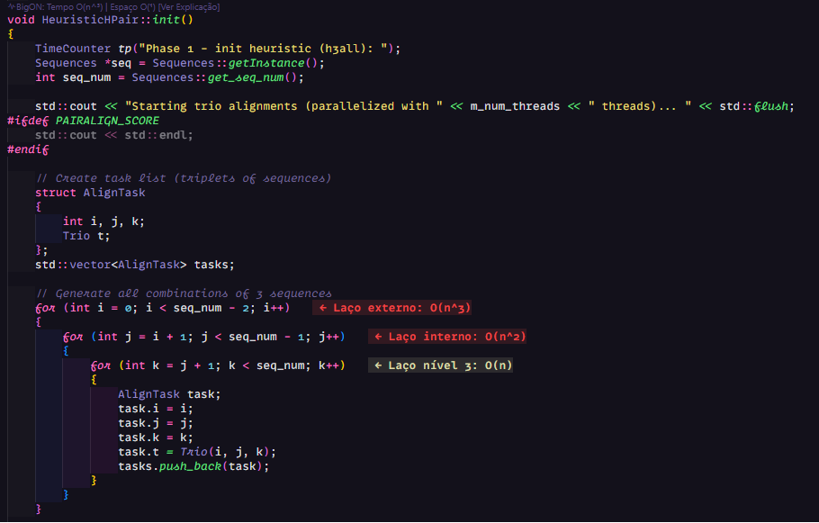
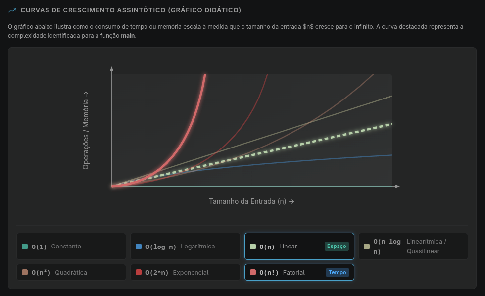

# BigON - Analisador de Complexidade Assintótica para VS Code

<div align="center">
  
</div>

## Proposta da Extensão

O **BigON** é uma extensão para **VS Code**, **VSCodium**, **Cursor**, **Antigravity** e editores compatíveis, desenvolvida para analisar a **complexidade assintótica de Tempo \(O(...)\) e Espaço \(O(...)\)** de funções em tempo real.

Diferente de profilings de execução, o BigON realiza **análise estática** através da **Árvore Sintática Abstrata (AST)** do código-fonte e heurísticas estruturais, calculando a ordem de grandeza do algoritmo **sem a necessidade de executar o programa**.

### Destaques Principais:
- **Análise Instantânea**: Feedback visual de complexidade enquanto você digita.
- **Não Executa Código**: Análise 100% estática e segura via AST.
- **Foco Educacional**: Explication detalhada embasada nos princípios de algoritmos (CLRS / Cormen et al.) com gráficos interativos de curvas Big-O.
- **Suporte Multi-Linguagem**: JavaScript, TypeScript, React (JSX/TSX), Python, Ruby, C++ e C.

<div align="center">
  <p><b>CodeLens e Anotações In-line no Editor</b></p>
  
  <br><br>
  <p><b>Painel de Explicação Assintótica Interativo</b></p>
  
</div>


## Como Baixar e Instalar

Você pode instalar o **BigON** diretamente pelo Marketplace do seu editor ou manualmente via pacote `.vsix`.

### 1. Pelo Marketplace (Recomendado)

#### No VS Code:
1. Abra o VS Code.
2. Acesse a aba de Extensões com `Ctrl+Shift+X` (no macOS: `Cmd+Shift+X`).
3. Pesquise por **`BigON`** ou **`vncsmnl.BigON`**.
4. Clique em **Instalar** (Install).
5. Alternativamente, acesse a página no [VS Code Marketplace](https://marketplace.visualstudio.com/items?itemName=vncsmnl.BigON) e clique no botão **Install**.

#### No VSCodium, Cursor, Antigravity e outros editores baseados em VS Code / Open VSX:
1. Abra a aba de Extensões (`Ctrl+Shift+X` / `Cmd+Shift+X`).
2. Digite **`BigON`** na barra de busca.
3. Clique em **Instalar**.

---

### 2. Instalação Manual via Arquivo `.vsix`

Caso você esteja offline, utilizando uma rede corporativa restrita ou deseje testar uma versão pré-compilada específica:

#### Passo A: Obter o Arquivo `.vsix`
- **Via Releases do GitHub**: Baixe a versão mais recente `.vsix` diretamente na página de [Releases do Repositório](https://github.com/vncsmnl/BigON/releases).
- **Gerando Localmente**: Se você possui o código-fonte clonado, execute:
  ```bash
  npx @vscode/vsce package
  ```
  Isso gerará o arquivo `BigON-1.0.1.vsix` no diretório raiz do projeto.

#### Passo B: Instalar no Editor

##### Opção 1: Pela Interface Gráfica (GUI)
1. Abra o VS Code / VSCodium / Cursor / Antigravity.
2. Abra a aba de Extensões (`Ctrl+Shift+X`).
3. Clique no menu de três pontinhos **`...`** (no canto superior direito da aba de extensões).
4. Selecione **`Instalar a partir de VSIX...`** (`Install from VSIX...`).
5. Escolha o arquivo `BigON-1.0.1.vsix` baixado ou gerado.

##### Opção 2: Pela Linha de Comando (Terminal / CLI)
Abra seu terminal e execute o comando correspondente ao seu editor:

```bash
# Para VS Code:
code --install-extension BigON-1.0.1.vsix

# Para VSCodium:
codium --install-extension BigON-1.0.1.vsix

# Para Cursor:
cursor --install-extension BigON-1.0.1.vsix
```

---

## Como Usar

Assim que instalada, a extensão é ativada automaticamente ao abrir qualquer arquivo em uma das linguagens suportadas (`.js`, `.ts`, `.jsx`, `.tsx`, `.py`, `.rb`, `.cpp`, `.c`).

### Recursos no Editor

1. **CodeLens (Cabeçalho de Função)**:
   - Acima de cada função declarada, aparecerá um resumo de complexidade:
     `BigON: Tempo O(n²) | Espaço O(1) [Ver Explicação]`
   - Clique em **`[Ver Explicação]`** para abrir o painel interativo.

2. **Anotações In-line (Linha a Linha)**:
   - No final das linhas que contêm laços de repetição ou estruturas relevantes, a extensão indica o custo incremental (ex: `← Custo: O(n)` ou `← Custo: O(log n)`).

3. **Balão Informativo (Hover)**:
   - Ao passar o mouse sobre o nome de uma função, um pop-up exibirá a complexidade calculada e uma breve justificativa.

4. **Painel Webview de Explicação**:
   - Exibe a derivação matemática e lógica do cálculo da função, com explicações didáticas e gráficos comparativos das curvas de crescimento Big-O (\(O(1)\), \(O(\log n)\), \(O(n)\), \(O(n \log n)\), \(O(n^2)\), \(O(2^n)\), \(O(n!)\)).

---

## Comandos Disponíveis

Abra a paleta de comandos (`Ctrl+Shift+P` ou `Cmd+Shift+P`) e digite:

| Comando | ID do Comando | Descrição |
| :--- | :--- | :--- |
| **BigON: Analisar Complexidade do Arquivo** | `BigON.analyzeFile` | Força a re-análise completa do arquivo atualmente aberto. |
| **BigON: Alternar Anotações In-line** | `BigON.toggleDecorations` | Liga ou desliga as anotações visuais no final das linhas de laço. |
| **BigON: Abrir Painel de Explicação** | `BigON.openExplanation` | Abre o painel Webview com os detalhes da função sob o cursor. |

---

## Configurações

Nas configurações do editor (`Settings` -> pesquise por `BigON`), você pode customizar:

- `BigON.enableCodeLens`: Exibir ou ocultar o cabeçalho CodeLens acima das funções (`default: true`).
- `BigON.enableInlineDecorations`: Exibir ou ocultar anotações no final das linhas (`default: true`).
- `BigON.enableHover`: Exibir balão explicativo ao passar o mouse sobre funções (`default: true`).

---

## Padrões Reconhecidos

| Padrão de Código | Complexidade de Tempo | Explicação |
| :--- | :---: | :--- |
| `for (let i = 0; i < n; i++)` | **`O(n)`** | Incremento linear constante |
| Dois laços `for` aninhados | **`O(n²)`** | Produto das iterações \(O(n) \times O(n)\) |
| Multiplicação no laço (`i *= 2`) | **`O(log n)`** | Crescimento logarítmico |
| Divisão sucessiva (`n /= 2`) | **`O(log n)`** | Redução do espaço de busca |
| Recursão simples `f(n/2)` | **`O(log n)`** | Divisão sucessiva (ex: Busca Binária) |
| Recursão `2 * f(n/2) + O(n)` | **`O(n log n)`** | Divisão e Conquista (ex: Merge Sort) |
| Recursão `f(n-1) + f(n-2)` | **`O(2ⁿ)`** | Ramificação binária exponencial |
| Recursão com laço interno `for` | **`O(n!)`** | Permutações / Arranjos |

---

## Desenvolvimento e Contribuição

Se você é desenvolvedor e deseja compilar o projeto localmente, debugar, adicionar suporte a novas linguagens ou criar novas regras de análise AST:

**Consulte a documentação técnica detalhada na pasta [`/docs`](./docs/README.md):**
- **[Guia de Contribuição (`/docs/CONTRIBUTING.md`)](./docs/CONTRIBUTING.md)**: Setup do ambiente, comandos de teste (`npm test`), compilação e tutorial para adicionar novas regras e parsers.
- **[Arquitetura do Sistema (`/docs/ARCHITECTURE.md`)](./docs/ARCHITECTURE.md)**: Visão detalhada do motor de análise (`ComplexityEngine`), parsers sintáticos, pipeline Big-O e ciclo de vida das decorações e Webview.

---

## Limitações da Análise Estática

A extensão **BigON** utiliza análise estática via **AST** (para JavaScript/TypeScript) e identificadores heurísticos sintáticos para Python, Ruby, C++ e C. 

As estimativas representam diagnósticos estáticos baseados em padrões estruturais típicos de código e **não constituem provas matemáticas formais em runtime**. Códigos com compilação dinâmica, metaprogramação, dependência exclusiva de dados recebidos em tempo de execução ou recursões indiretas complexas podem apresentar estimativas aproximadas.

---

## Licença

Este projeto está sob a licença **MIT**. Veja o arquivo [LICENSE](./LICENSE) para mais detalhes.