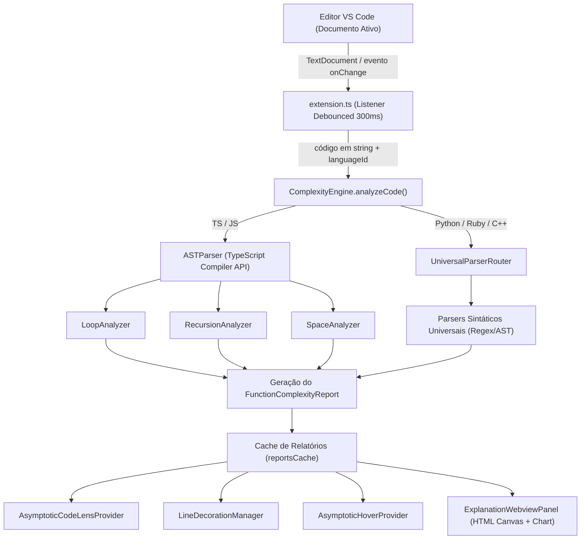

# Arquitetura e Funcionamento Interno - BigON

Este documento oferece um detalhamento técnico completo da arquitetura do **BigON**, descrevendo como o código-fonte é analisado de forma estática via Árvores Sintáticas Abstratas (AST) ou Parsers Sintáticos Universais, como as complexidades de tempo `O` e espaço `O` são calculadas e como a extensão se integra à interface gráfica do **VS Code**.

---

## 📐 Visão Geral da Arquitetura

O sistema é dividido estritamente em duas grandes camadas:

1. **Camada de Análise Assintótica (`src/analyzer/`)**: Independente do VS Code, responsável exclusivamente por ler texto/código e retornar relatórios numéricos/assintóticos (`FunctionComplexityReport`).
2. **Camada de Apresentação e Integração UI (`src/ui/` + `src/extension.ts`)**: Responsável por capturar eventos do editor, manter cache de relatórios e renderizar CodeLens, decorações nas linhas, hovers e o painel Webview.

### Fluxo de Dados e Execução



---

## 🧩 Componentes do Motor de Análise (`src/analyzer/`)

### 1. `ComplexityEngine` (`src/analyzer/complexityEngine.ts`)
Atua como a fachada e orquestrador central. Ao receber o código-fonte de um arquivo:
- Normaliza a extensão/linguagem via `normalizeLanguageId()`.
- Se a linguagem for `typescript` ou `javascript`, utiliza a **TypeScript Compiler API** (`ts.createSourceFile`) para gerar uma AST completa e precisa de nós tipados (`ts.Node`).
- Se a linguagem for `python`, `ruby` ou `cpp`, roteia para o `UniversalParserRouter`.

### 2. Análise AST Nativa (TS/JS)

#### A. `ASTParser` (`src/analyzer/astParser.ts`)
Converte a string do código em uma árvore `ts.SourceFile` com suporte ao dialecto mais moderno do TypeScript/ESNext.

#### B. `LoopAnalyzer` (`src/analyzer/loopAnalyzer.ts`)
Inspeciona todos os laços dentro da função (`ts.ForStatement`, `ts.ForOfStatement`, `ts.ForInStatement`, `ts.WhileStatement`, `ts.DoStatement`):
- **Passo / Incremento**: Analisa o modificador do laço (ex: `i++` vs `i *= 2` vs `n /= 2`).
- **Aninhamento**: Constrói uma hierarquia de profundidade entre laços pai/filho.
- **Multiplicação de Custos**: Calcula a complexidade multiplicando a complexidade do laço externo pela do laço interno (ex: `O(n) × O(n) = O(n²)`).
- **Função Auxiliar `maxBigO()` e `multiplyBigO()`**: Permite operar aritmeticamente sobre termos Big-O:
  `max(O(n), O(log n)) = O(n)`
  `O(n) × O(log n) = O(n log n)`

#### C. `RecursionAnalyzer` (`src/analyzer/recursionAnalyzer.ts`)
Mapeia chamadas auto-referenciais dentro do corpo da função:
- **Quantidade de chamadas por execução**: 1 chamada (`O(n)` ou `O(log n)`) vs 2+ chamadas (`O(2^n)` - como Fibonacci tradicional).
- **Redução de Argumento**: Detecta divisão do tamanho do problema (ex: `f(n/2)` indica busca binária ou divisão e conquista) versus redução subtrativa (`f(n-1)`).
- **Combinação com Laços Internos**: Detecta permissões de permutações `O(n!)` ou divisão e conquista `O(n log n)` (como no Merge Sort ou QuickSort).

#### D. `SpaceAnalyzer` (`src/analyzer/spaceAnalyzer.ts`)
Mapeia o consumo de memória auxiliar:
- Identifica criação de novos vetores/estruturas de tamanho proporcional à entrada `n` (`new Array(n)`, `Array.from`, alocações dinâmicas).
- Pilha de Execução Recursiva: Toda recursão de profundidade `n` contribui com no mínimo `O(n)` de espaço na Call Stack, e de profundidade `log n` contribui com `O(log n)`.

---

## 🌐 Parsers Sintáticos Universais (`src/analyzer/universal/`)

Para linguagens que não utilizam o compilador TypeScript nativo, o BigON utiliza uma arquitetura baseada em **AST Universal**:

- **`UniversalFunctionNode`**: Representa uma função contendo intervalos de linhas (`startLine`, `endLine`), lista de laços aninhados, chamadas recursivas, alocações de memória e flags de divisão.
- **`PythonUniversalParser`**: Analisa a indentação característica do Python, laços `for x in range(...)`, `while`, e chamadas recursivas.
- **`RubyUniversalParser`**: Analisa blocos `def...end`, `.each`, `times`, `while`.
- **`CppUniversalParser`**: Analisa laços `for (int i = 0; i < n; i++)`, `while`, ponteiros e vetores `std::vector`.

---

## 🎨 Componentes de Interface VS Code (`src/ui/`)

### 1. `AsymptoticCodeLensProvider` (`src/ui/codeLensProvider.ts`)
Implementa a interface `vscode.CodeLensProvider`. Insere um botão interativo acima da assinatura de cada função com o formato:
`BigON: Tempo O(n²) | Espaço O(1) [Ver Explicação]`
Ao clicar, aciona o comando `BigON.openExplanation`.

### 2. `LineDecorationManager` (`src/ui/lineDecorations.ts`)
Utiliza `vscode.window.createTextEditorDecorationType` para renderizar anotações discretas no final de linhas específicas (como laços `for` e `while`), indicando visualmente onde o custo assintótico é incorrido:
`← Custo: O(n) [Laço linear]`

### 3. `AsymptoticHoverProvider` (`src/ui/hoverProvider.ts`)
Implementa `vscode.HoverProvider`. Quando o desenvolvedor posiciona o cursor do mouse sobre o nome de uma função, o VS Code exibe uma janela tooltip com um resumo explicativo formatado em Markdown com ícones e justificativas.

### 4. `ExplanationWebviewPanel` (`src/ui/webviewPanel.ts`)
Abre um painel lateral/central rico feito com HTML5, CSS3 avançado (modo escuro elegante, efeitos de iluminação e componentes visuais) e um elemento `<canvas>` com gráficos dinâmicos das curvas de crescimento Big-O (`O(1)`, `O(log n)`, `O(n)`, `O(n log n)`, `O(n²)`, `O(2^n)`), ajudando o desenvolvedor a entender intuitivamente a escalabilidade do algoritmo.

---

## 📊 Hierarquia das Complexidades Big-O

O motor reconhece e ordena as complexidades na seguinte escala de dominância assintótica:

`O(1) < O(log n) < O(sqrt n) < O(n) < O(n log n) < O(n²) < O(n³) < O(n⁴) < O(2^n) < O(n!)`

---

## 🔑 Principais Interfaces do Sistema (`src/analyzer/types.ts`)

```typescript
export type BigOComplexity =
  | 'O(1)'
  | 'O(log n)'
  | 'O(sqrt n)'
  | 'O(n)'
  | 'O(n log n)'
  | 'O(n^2)'
  | 'O(n^3)'
  | 'O(n^4)'
  | 'O(2^n)'
  | 'O(n!)'
  | 'O(desconhecido)';

export interface LineAnnotation {
  line: number;
  cost: BigOComplexity;
  label: string;
  explanation: string;
}

export interface ReasoningStep {
  type: 'loop' | 'recursion' | 'space' | 'summary';
  title: string;
  detail: string;
  complexity: BigOComplexity;
  lineRange?: { start: number; end: number };
}

export interface FunctionComplexityReport {
  functionName: string;
  startLine: number;
  endLine: number;
  timeComplexity: BigOComplexity;
  spaceComplexity: BigOComplexity;
  annotations: LineAnnotation[];
  reasoningSteps: ReasoningStep[];
  isRecursive: boolean;
}
```

---

## 🔄 Ciclo de Vida da Extensão (`src/extension.ts`)

1. **Ativação (`activate`)**:
   - Registra o `CodeLensProvider`, `HoverProvider` e os comandos (`BigON.analyzeFile`, `BigON.toggleDecorations`, `BigON.openExplanation`).
   - Registra listeners para troca de aba (`onDidChangeActiveTextEditor`) e alteração no documento (`onDidChangeTextDocument`).
2. **Debounce (300ms)**:
   - Para evitar consumo excessivo de CPU durante a digitação contínua, as atualizações de análise utilizam um temporizador de *debounce* de 300 milissegundos.
3. **Gerenciamento de Memória (`reportsCache`)**:
   - Os relatórios de funções por arquivo são mantidos em uma tabela `Map<string, FunctionComplexityReport[]>`.
   - Quando o arquivo é fechado no editor, o evento `onDidCloseTextDocument` remove a entrada do cache para prevenir vazamento de memória.
